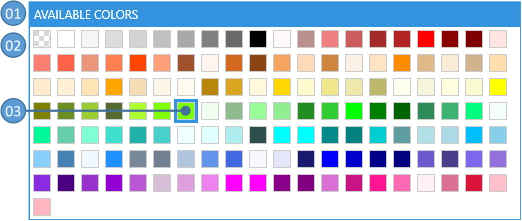
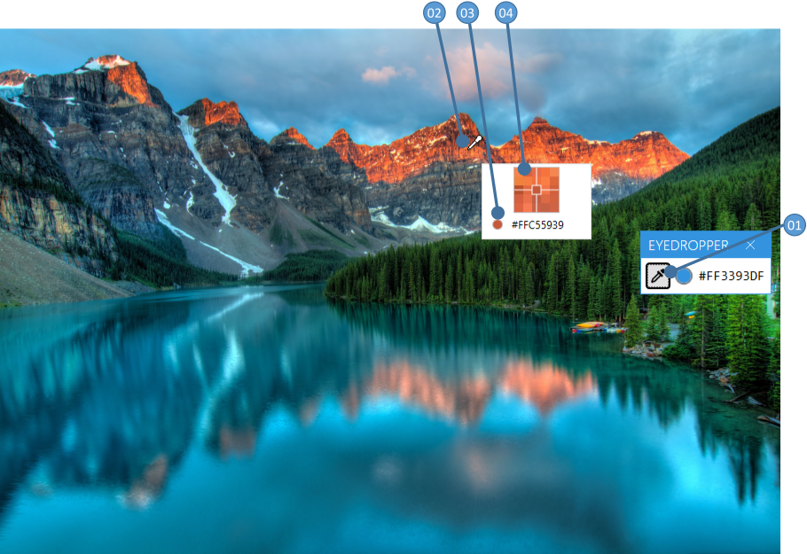
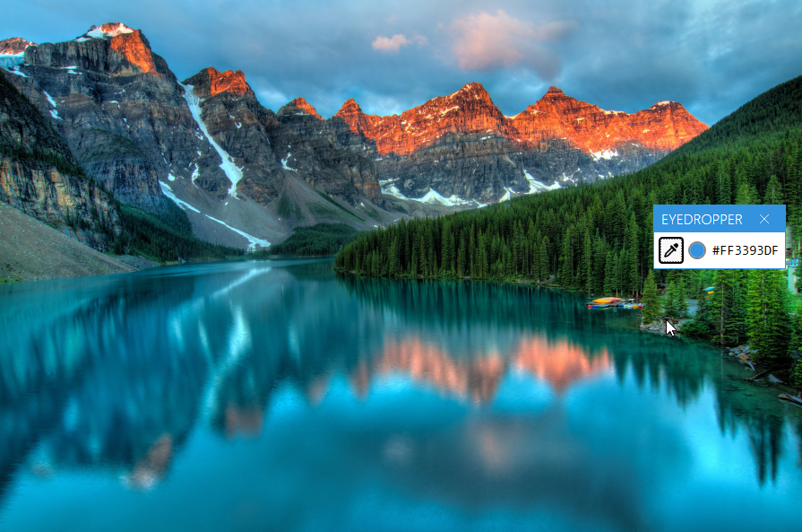
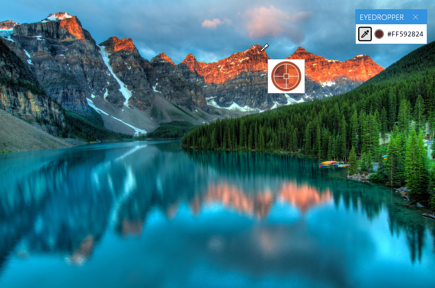
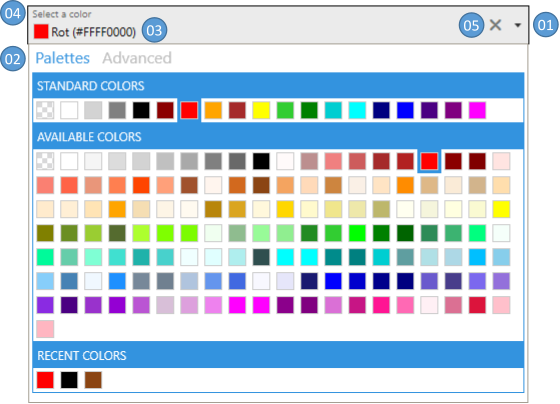
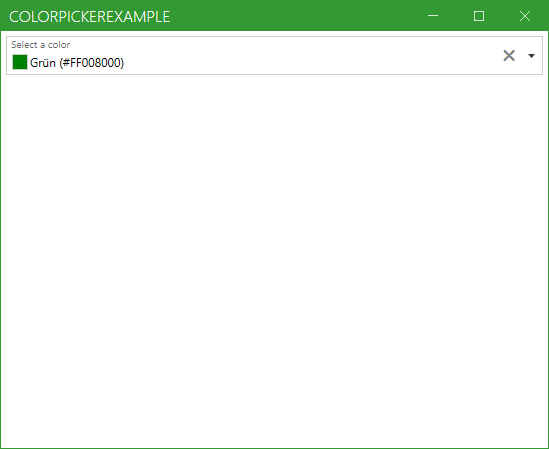

Title: ColorPicker
Description: The documentation for the ColorPicker, ColorCanvas, ColorPallette and ColorEyeDropper
---
# Table of content
<!-- Start Document Outline -->

* [Introduction](#introduction)
* [ColorNamesDictionary and ColorHelper](#colornamesdictionary-and-colorhelper)
	* [Looking up a color name](#looking-up-a-color-name)
	* [Getting a color from a given name](#getting-a-color-from-a-given-name)
	* [How to provide custom color names](#how-to-provide-custom-color-names)
	* [Provide translations for a language of your choice](#provide-translations-for-a-language-of-your-choice)
* [ColorCanvas](#colorcanvas)
	* [The user interface](#the-user-interface)
	* [Properties](#properties)
	* [Attached Properties (Helper)](#attached-properties-helper)
	* [Events](#events)
	* [DynamicResources](#dynamicresources)
	* [Example](#example)
* [ColorPalette](#colorpalette)
	* [The user interface](#the-user-interface-1)
	* [Properties](#properties-1)
	* [Attached Properties (Helper)](#attached-properties-helper-1)
	* [DynamicResources](#dynamicresources-1)
	* [Example](#example-1)
	* [Build in color palettes](#build-in-color-palettes)
* [ColorEyeDropper](#coloreyedropper)
	* [The user interface](#the-user-interface-2)
	* [Properties](#properties-2)
	* [Attached Properties (Helper)](#attached-properties-helper-2)
	* [Events](#events-1)
	* [DynamicResources](#dynamicresources-2)
	* [Example](#example-2)
* [ColorPicker](#colorpicker)
	* [The user interface](#the-user-interface-3)
	* [Properties](#properties-3)
	* [Attached Properties (Helper)](#attached-properties-helper-3)
	* [Events](#events-2)
	* [DynamicResources](#dynamicresources-3)
	* [Example](#example-3)

<!-- End Document Outline -->

---

# Introduction

The `ColorPicker`-Controls can be used to select any `System.Windows.Media.Color` (in this document simply called `Color`). There are four different controls available to select a `Color`:

| Control           | Use case                                  |
|-------------------|------------------------------------------|
| [`ColorCanvas`](#colorcanvas)     | Select a `Color` by specifying its [ARGB](https://en.wikipedia.org/wiki/RGB_color_model) or [AHSV](https://en.wikipedia.org/wiki/HSL_and_HSV) channels |
| [`ColorPalette`](#colorpalette)    | Select a `Color` from predefined colors presented in a special `ListBox` |
| [`ColorEyeDropper`](#coloreyedropper) | Select a `Color` from anywhere on the screen |
| [`ColorPicker`](#colorpicker)     | A combination of the three controls above presented in a `ComboBox`-like control |

# ColorNamesDictionary and ColorHelper
Colors may have a name which is localize-able if you want to. The color names are stored in a `Dictionary<Color?,string>` which is used to get the name of the provided `Color`. 

## Looking up a color name
If you want to look up a name of a given `Color` use this line: 

```c#
// Note: If you set the second parameter to 'null' the default dictionary will be used. 
string nameOfMyColor = MahApps.Metro.Controls.ColorHelper.GetColorName(myColor, theDictionaryToUse);
```

## Getting a color from a given name
You can also get back the color by looking up its name. The routine will first check the dictionary for the first occurrence of the given name and if it was not found it will try to use [`ColorConverter.ConvertFromString`](docs.microsoft.com/en-us/dotnet/api/system.windows.media.colorconverter.convertfromstring) which also accepts the HTML-Notation of the `Color`. If the `Color` cannot be found it will return null. Below you can find some examples.

```
// Note: If you set the second parameter to 'null' the default dictionary will be used.  
Color? myColor = MahApps.Metro.Controls.ColorHelper.ColorFromString(myColorName, theDictionaryToUse);

// this will look up the German word "Blau" and returns blue color
Color? myColor = MahApps.Metro.Controls.ColorHelper.ColorFromString("Blau", null);

// this will look up the HTML-notation "#FF000000" and returns black color
Color? myColor = MahApps.Metro.Controls.ColorHelper.ColorFromString("#FF000000", null);
```


## How to provide custom color names
You can change the build in dictionary via `MahApps.Metro.Controls.ColorHelper.ColorNamesDictionary` by adding, removing or changing any dictionary entry. You can also create your own `Dictionary<Color?,string>` anywhere in your `Model` or `ViewModel` to provide your own color names. That way you can use also different dictionaries for different `ColorPicker`. 

Example:
```c#
Dictionary<Color?,string> myColorNames = new Dictionary<Color?,string>()
{
    { Colors.Green, "every thing is fine" }, 
    { Colors.Yellow, "warning" },
    { Colors.Red, "error" }
};
```
## Provide translations for a language of your choice
You can help providing translations to the build in dictionary. Currently implemented language:
- English
- German

To do so we recommend using the [ResXManager](https://marketplace.visualstudio.com/items?itemName=TomEnglert.ResXManager) and please read [this guide](https://github.com/MahApps/MahApps.Metro/wiki/Contributing)

# ColorCanvas
The `ColorCanvas` lets the user select a `Color` by either manipulating the ARGB-Values, manipulating the HSV-Values, entering the color name or HTML-notation or picking a color from the screen.

## The user interface


| No. | Description                              |
|-----|------------------------------------------|
| 01  | Red color channel from 0 to 255          |
| 02  | Green color channel from 0 to 255        |
| 03  | Blue color channel from 0 to 255         |
| 04  | Hue channel from 0° to 360°              |
| 05  | Saturation channel from 0% to 100%       |
| 06  | Value channel from 0% to 100 %           |
| 07  | Alpha channel from 0 to 255              |
| 08  | The color name or html-notation          |
| 09  | A [`ColorEyeDropper`](#coloreyedropper) to select a color from the screen |
| 10  | Select the saturation by moving the cross-hair from horizontally and the value by moving the cross-hair vertically |
| 11 | A preview of the selected color | 

## Properties
Use the following properties to handle the color selection 

| Property             | Type                       | Description                              |
|----------------------|----------------------------|------------------------------------------|
| `SelectedColor`        | `Color?`                     | Gets or sets the selected color          |
| `DefaultColor`         | `Color?`                     | Gets or sets the default color if the `SelectedColor` is `null` |
| `SelectedHSVColor`     | `HSVColor`                   | Gets the selected color as `HSVColor`    |
| `ColorName`            | `string`                     | Gets or sets the name of the selected color [(see also `ColorHelper`)](#colornamesdictionary-and-colorhelper) |
| `ColorNamesDictionary` | `Dictionary<Color?, string>` | Gets or sets the `Dictionary<Color?, string>` used to get or set the `ColorName` [(see also `ColorHelper`)](#colornamesdictionary-and-colorhelper)|
| `A`                    | `byte`                       | Gets or sets the alpha channel           |
| `R`                    | `byte`                       | Gets or sets the red channel             |
| `G`                    | `byte`                       | Gets or sets the green channel           |
| `B`                    | `byte`                       | Gets or sets the blue-channel            |
| `Hue`                  | `double`                     | Gets or sets the hue channel             |
| `Saturation`           | `double`                     | Gets or sets the Saturation-channel      |
| `Value`                | `double`                     | Gets or sets the Value-channel           |

Use the following properties to translate the user interface

| Property               | Type   | Description                              |
|------------------------|--------|------------------------------------------|
| `LabelAlphaChannel`      | `string` | Gets or sets the `Label` for the alpha-channel |
| `LabelRedChannel`        | `string` | Gets or sets the `Label` for the red-channel |
| `LabelGreenChannel`      | `string` | Gets or sets the `Label` for the green-channel |
| `LabelBlueChannel`       | `string` | Gets or sets the `Label` for the blue-channel |
| `LabelHueChannel`        | `string` | Gets or sets the `Label` for the hue-channel |
| `LabelSaturationChannel` | `string` | Gets or sets the `Label` for the saturation-channel |
| `LabelValueChannel`      | `string` | Gets or sets the `Label` for the value-channel |
| `LabelColorPreview`      | `string` | Gets or sets the `Label` for the preview field |
| `LabelColorName`         | `string` | Gets or sets the `Label` for the color name |

## Attached Properties (Helper)
You can use these attached helper:
- `TextBoxHelper`

## Events
| Event                | Description                            |
|----------------------|----------------------------------------|
| `SelectedColorChanged` | Occurs when the `SelectedColor` changed |

## DynamicResources
You can override the following `Resources` to modify the appearance of the `ColorCanvas` further. 

| Key                                      | Type         | Description                              |
|------------------------------------------|--------------|------------------------------------------|
| `MahApps.Brushes.Tile`                     | `Brush`        | Overrides the checkered `Brush` which is visible if the color is transparent |
| `MahApps.DataTemplates.ColorPicker.NoColor` | `DataTemplate` | Overrides the `DataTemplate` of the preview if no color is selected |
| `MahApps.Styles.Slider.ColorComponent.ARGB` | `Style`        | Overrides the `Style` of the A-, R-, G- and B-`Slider` |
| `MahApps.Styles.Slider.ColorComponent.Hue` | `Style`        | Overrides the `Style` of the Hue-Slider    |
| `MahApps.Styles.Slider.ColorComponent.SV`  | `Style`        | Overrides the `Style` of the S- and V-`Slider` |
| `MahApps.Styles.ColorEyeDropper.ColorCanvas` | `Style`        | Overrides the Style of the `ColorEyeDropper` |


## Example

```xaml
<!-- make sure to add the right namespace -->
<!-- xmlns:mah="http://metro.mahapps.com/winfx/xaml/controls" -->

<mah:ColorCanvas x:Name="ColorCanvasExample"
                 SelectedColor="Blue"
                 DefaultColor="Transparent"
                 LabelAlphaChannel="Alpha"
                 LabelBlueChannel="Blue"
                 LabelGreenChannel="Green"
                 LabelRedChannel="Red" />
```

# ColorPalette
The `ColorPalette` can be used to present the user a swatch of predefined colors. As this control is derived from `System.Windows.Controls.ListBox` you can use all functionality know from the `ListBox`-Control

## The user interface



| No | Description                              |
|----|------------------------------------------|
| 01 | The header of the `ColorPalette`         |
| 02 | Displays the available colors            |
| 03 | The currently selected color is highlighted |

## Properties
The available colors can be either added directly to the `Items`-property or by binding to the `ItemsSource`-property. The selection can be handled by binding to `SelectedValue`, `SelectedItem` or `SelectedIndex`. 

In addition to this the `ColorPalette` provides the following properties.

| Property             | Type                       | Description                              |
|----------------------|----------------------------|------------------------------------------|
| `Header`               | `object`                     | Gets or sets the header content          |
| `HeaderTemplate`       | `DataTemplate`               | Gets or sets the header template         |
| `ColorNamesDictionary` | `Dictionary<Color?, string>` | Gets or sets the `Dictionary<Color?, string>` used to get or set the ColorName [(see also `ColorHelper`)](#colornamesdictionary-and-colorhelper) |

## Attached Properties (Helper)
You can use these attached helper:
- `ControlsHelper`
- `ItemHelper`
- `HeaderedControlHelper`
- `ScrollViewerHelper`

## DynamicResources
| Key                                      | Type         | Description                              |
|------------------------------------------|--------------|------------------------------------------|
| `MahApps.Sizes.ColorListBox.ItemWidth`     | `double`       | Overrides the width of the items         |
| `MahApps.Sizes.ColorListBox.ItemHeight`    | `double`       | Overrides the height of the items        |
| `MahApps.Brushes.Tile.Small`               | `Brush`        | Overrides the checkered Brush which is visible if the color is transparent |
| `MahApps.Styles.ListBoxItem.ColorPaletteItem` | `Style`        | Overrides the `Style` of the items       |
| `MahApps.Templates.ColorPaletteItem`       | `DataTemplate` | Overrides the `DataTemplate` of the items |
| `MahApps.Styles.ColorPalette` | `Style`        | Overrides the default `Style` for the `ColorPalette` |

## Example
The below example shows how to use the `ColorPalette` via setting the `ItemsSource` to a build in `ColorPalette`. 

> Note: MahApps provides [build in color palettes](#build-in-color-palettes)

```xaml
<!-- make sure to add the right namespace -->
<!-- xmlns:mah="http://metro.mahapps.com/winfx/xaml/controls" -->

<mah:ColorPalette Header="An Example Palette" 
                  ItemsSource="{x:Static mah:BuildInColorPalettes.WpfColorsPalette}" />
``` 

The second example shows how to add colors directly in `XAML`

```xaml
<!-- make sure to add the right namespace -->
<!-- xmlns:mah="http://metro.mahapps.com/winfx/xaml/controls" -->

<mah:ColorPalette Header="A second Example Palette" >
    <Color>Red</Color>
    <Color>Green</Color>
    <Color>Blue</Color>
</mah:ColorPalette>
```

## Build in color palettes 
MahApps provides the following build in ColorPalettes:
- WpfColorsPalette (all colors in `Sytem.Windows.Media.Colors`)
- StandardColorsPalette (the primary colors)
- RecentColors (used to store the recently selected colors)

All build in `ColorPalettes` are internally an `ObservableCollection`, so you can modify them to your needs.

# ColorEyeDropper
The `ColorEyeDropper` lets the user select a `Color` with the mouse directly from anywhere on the screen, even outside of your `Application`. As this control is derived from `System.Windows.Controls.Button` you can use all functionality know from the `Button`-Control.

## The user interface
If the user presses the left mouse button on the `ColorEyeDropper` the cursor will change to an eye-dropper symbol and a preview popup will appear. Now the user needs to keep the mouse pressed while dragging the mouse to the desired pixel. A magnifier with a cross hair helps getting the exact pixel position. As soon as the user releases the left mouse button the `SelectedColor`-property will get updated. 



| No | Description                              |
|----|------------------------------------------|
| 01 | The `Button` to start the `ColorEyeDropper` |
| 02 | The cursor while selecting a color       |
| 03 | A preview of the selected color          |
| 04 | A magnifier with a cross hair            |

**See it in action:**


## Properties
In addition to all known `Button`-properties the `ColorEyeDropper` supports the properties listed below.

| Property                    | Type         | Description                              |
|-----------------------------|--------------|------------------------------------------|
| `SelectedColor`               | `Color?`       | Gets or sets the selected color          |
| `PreviewImageOuterPixelCount` | `int`          | Gets or sets how many pixels the preview magnifier should render around the curent mouse position. The default is `2` |
| `EyeDropperCursor`            | `Cursor`       | Gets or sets the `Cursor` when in selection mode |
| `PreviewContentTemplate`      | `DataTemplate` | Gets or sets the `DataTemplate` of the preview `Popup` |

## Attached Properties (Helper)
You can use these attached helper:
- `ControlsHelper`

## Events
You can use all events known from a default `Button` and the one listed below. 

| Event                | Description                            |
|----------------------|----------------------------------------|
| `SelectedColorChanged` | Occurs when the `SelectedColor` changed |

## DynamicResources
For this control there is no `DynamicResource` which can be overridden beside the know ones for the other `Buttons`.

## Example
```xaml
<!-- make sure to add the right namespace -->
<!-- xmlns:mah="http://metro.mahapps.com/winfx/xaml/controls" -->

<mah:ColorEyeDropper Content="This is my EyeDropper"
                     SelectedColor="{Binding Path=MyColorToBind}" />
```

If you want to modify the preview template please take a look to the below example. It shows how to make a circular magnifier with the preview color shown in the outer circle.



> Note: the `DataTemplate` should be designed for this `DataType`:  `MahApps.Metro.Controls.ColorEyePreviewData`

```xaml
<!-- make sure to add the right namespace -->
<!-- xmlns:mah="http://metro.mahapps.com/winfx/xaml/controls" -->
<!-- xmlns:po="http://schemas.microsoft.com/winfx/2006/xaml/presentation/options" -->

<mah:ColorEyeDropper Content="{iconPacks:Material Kind=Eyedropper}"
                     SelectedColor="{DynamicResource MahApps.Colors.AccentBase}">
    <mah:ColorEyeDropper.PreviewContentTemplate>
        <DataTemplate DataType="{x:Type mah:ColorEyePreviewData}">
            <Border Width="62"
                    Height="62"
                    Padding="0"
                    BorderBrush="{Binding PreviewBrush}"
                    BorderThickness="5"
                    CornerRadius="{Binding RelativeSource={RelativeSource Mode=Self}, Path=ActualHeight, Converter={mah:SizeToCornerRadiusConverter}}">
                <Grid HorizontalAlignment="Center" VerticalAlignment="Center">
                    <Grid.Clip>
                        <EllipseGeometry Center="25,25"
                                         RadiusX="25"
                                         RadiusY="25" />
                    </Grid.Clip>
                    <Image x:Name="PART_PreviewImage"
                           Width="50"
                           Height="50"
                           RenderOptions.BitmapScalingMode="NearestNeighbor"
                           Source="{Binding PreviewImage}" />
                    <Path Stroke="{Binding PreviewBrush, Converter={x:Static mah:BackgroundToForegroundConverter.Instance}}" StrokeThickness="1">
                        <Path.Data>
                            <PathGeometry po:Freeze="true" Figures=" m 0 25 20 0  m 5 5 0 20  m 5 -25 20 0  m -25 -25 0 20 m -5 0 H20 H30 V30 H20 z" />
                        </Path.Data>
                    </Path>
                </Grid>
            </Border>
        </DataTemplate>
    </mah:ColorEyeDropper.PreviewContentTemplate>
</mah:ColorEyeDropper>
```

# ColorPicker
This control lets the user select a `Color` in a `ComboBox`-like control. The user can either select a `Color` from a predefined [`ColorPalette`](#colorpalette) or select a custom one in a [`ColorCanvas`](#colorcanvas)

## The user interface


| No | Description                              |
|----|------------------------------------------|
| 01 | Press the arrow to open or close the drop down |
| 02 | Select between the predefined colors tab and the advanced tab |
| 03 | Displays the selected color              |
| 04 | Optional: Shows a floating watermark     |
| 05 | Optional: A clear button to reset the `SelectedColor` either to `DefaultColor` or `null` |

## Properties
Use the following properties to handle the color selection 

| Property                 | Type                         | Description                              |
|--------------------------|------------------------------|------------------------------------------|
| `SelectedColor`            | `Color?`                     | Gets or sets the selected color          |
| `DefaultColor`             | `Color?`                     | Gets or sets the default color if the `SelectedColor` is `null` |
| `SelectedHSVColor`         | `HSVColor`                   | Gets the selected color as `HSVColor`    |
| `ColorName`                | `string`                     | Gets or sets the name of the selected color [(see also `ColorHelper`)](#colornamesdictionary-and-colorhelper) |
| `ColorNamesDictionary`     | `Dictionary<Color?, string>` | Gets or sets the `Dictionary<Color?, string>` used to get or set the `ColorName` [(see also `ColorHelper`)](#colornamesdictionary-and-colorhelper) |
| `A`                        | `byte`                       | Gets or sets the alpha channel           |
| `R`                        | `byte`                       | Gets or sets the red channel             |
| `G`                        | `byte`                       | Gets or sets the green channel           |
| `B`                        | `byte`                       | Gets or sets the blue-channel            |
| `Hue`                      | `double`                     | Gets or sets the hue channel             |
| `Saturation`               | `double`                     | Gets or sets the Saturation-channel      |
| `Value`                    | `double`                     | Gets or sets the Value-channel           |
| `AddToRecentColorsTrigger` | `AddToRecentColorsTrigger`   | Gets or sets the [`AddToRecentColorsTrigger`](#addtorecentcolorstrigger) |

Use the following properties to translate the user interface

| Property                       | Type           | Description                              |
|--------------------------------|----------------|------------------------------------------|
| `LabelAlphaChannel`              | `string`       | Gets or sets the `Label` for the alpha-channel |
| `LabelRedChannel`                | `string`       | Gets or sets the `Label` for the red-channel |
| `LabelGreenChannel`              | `string`       | Gets or sets the `Label` for the green-channel |
| `LabelBlueChannel`               | `string`       | Gets or sets the `Label` for the blue-channel |
| `LabelHueChannel`                | `string`       | Gets or sets the `Label` for the hue-channel |
| `LabelSaturationChannel`         | `string`       | Gets or sets the `Label` for the saturation-channel |
| `LabelValueChannel`              | `string`       | Gets or sets the `Label` for the value-channel |
| `LabelColorPreview`              | `string`       | Gets or sets the `Label` for the preview field |
| `LabelColorName`                 | `string`       | Gets or sets the `Label` for the color name |
| `ColorPalettesTabHeader`         | `object`       | Gets or sets the `Header` of the `ColorPalettes`-tab |
| `ColorPalettesTabHeaderTemplate` | `DataTemplate` | Gets or sets the `DataTemplate` for the `Header` of the `ColorPalettes`-tab |
| `AdvancedTabHeader`              | `object`       | Gets or sets the `Header` of the `ColorCanvas`-tab |
| `AdvancedTabHeaderTemplate`      | `DataTemplate` | Gets or sets the `DataTemplate` for the `Header` of the `ColorCanvas`-tab |

If you want to control the appearance of the `DropDown` you can adjust these properties 

| Property                       | Type           | Description                              |
|--------------------------------|----------------|------------------------------------------|
| `DropDownHeight`                 | `double`       | Gets or sets the height of the `DropDown` |
| `DropDownWidth`                  | `double`       | Gets or sets the width of the `DropDown` |
| `IsDropDownOpen`                 | `bool`         | Gets or sets whether the `DropDown` is open |
| `IsAdvancedTabVisible`           | `bool`         | Gets or sets whether the advanced tab is visible |
| `IsColorPalettesTabVisible`      | `bool`         | Gets or sets whether the standard tab is visible |
| `TabControlStyle`                | `Style`        | Gets or sets the `Style` for the `TabControl` inside the `DropDown` |
| `TabItemStyle`                   | `Style`        | Gets or sets the `Style` for the `TabItems` inside the `DropDown` |

The `ColorPicker` can hold up to five different [`ColorPalettes`](#colorpalette) which can be controlled by the following properties. As the properties repeat for all five `ColorPalettes` we use <b>[###ColorPalette]</b> as a placeholder. In your code please replace it with one of these names: 
 - `StandardColorPalette`
 - `AvailableColorPalette`
 - `RecentColorPalette`
 - `CustomColorPalette01`
 - `CustomColorPalette02`
 
 | Property                        | Type           | Description                              |
|---------------------------------|----------------|------------------------------------------|
| `[###ColorPalette]Header`         | `object`       | Gets or sets the header content of the `ColorPalette` |
| `[###ColorPalette]HeaderTemplate` | `DataTemplate` | Gets or sets the header content template of the `ColorPalette` |
| `[###ColorPalette]ItemsSource`    | `IEnumerable`  | Gets or sets the `ItemsSource` of the `ColorPalette` |
| `[###ColorPalette]Style`          | `Style`        | Gets or sets the `Style` of the `ColorPalette` |
| `Is[###ColorPalette]Visible`      | `bool`         | Gets or sets whether the `ColorPalette` is visible |

The `RecentColorPalette` is a special `ColorPalette` which is used to store the recent selected colors. To control the behavior of this `ColorPalette` you can use these two properties.

| Property                 | Type   | Description                              |
|--------------------------|--------|------------------------------------------|
| `AddToRecentColorsTrigger` | `Enum` | Gets or sets the trigger when the `RecentColorsPalette` should be updated. Possible values are `Never`, `ColorPickerClosed` or `SelectedColorChanged`. The default is `ColorPickerClosed` |
| `MaximumRecentColorsCount` | `int`  | This is an attached property which gets or sets the maximum number of recent color items. If the number stored in the `RecentColorPalette` exceeds this value the oldest entries will be removed. |

## Attached Properties (Helper)
You can use these attached helper:
- `TextBoxHelper`
- `ControlsHelper`

## Events
| Event                | Description                              |
|----------------------|------------------------------------------|
| `DropDownOpened`       | Occurs when the `DropDown` opened        |
| `DropDownClosed`       | Occurs when the `DropDown` closed        |
| `SelectedColorChanged` | Occurs when the `SelectedColor`-Property changed |

## DynamicResources
You can override the following `Resources` to modify the appearance of the `ColorPicker` further.

| Key                                      | Type           | Description                              |
|------------------------------------------|----------------|------------------------------------------|
| `MahApps.Templates.ColorPickerContent.ColorAndName` | `DataTemplate` | Overrides the default `DataTemplate` for the `SelectedColorTemplate`-Property |
| `MahApps.Brushes.Tile`                   | `Brush`        | Overrides the checkered Brush which is visible if the color is transparent |
| `MahApps.Styles.TabControl.ColorPicker`  | `Style`        | Overrides the `Style` for the `TabControl` inside the `DropDown` |
| `MahApps.Styles.ToggleButton.ColorPickerDropDown` | `Style`        | Overrides the `Style` for the `ColorPicker`-`ToggleButton` |
| `MahApps.Styles.ColorPalette.ColorPickerDropDown` | `Style`        | Overrides the `Style` for the `ColorPicker`-[`ColorPalette`](#colorpalette) |

## Example

```xaml
<!-- make sure to add the right namespace -->
<!-- xmlns:mah="http://metro.mahapps.com/winfx/xaml/controls" -->

<mah:ColorPicker SelectedColor="{Binding myColor}" 
                 mah:TextBoxHelper.ClearTextButton="True"
                 mah:TextBoxHelper.UseFloatingWatermark="True"
                 mah:TextBoxHelper.Watermark="Select a color"
                 AddToRecentColorsTrigger="SelectedColorChanged" />
```

The following example shows how the `SelectedColorChanged`-Event can be used to create a custom theme. 

```xaml
<!-- make sure to add the right namespace -->
<!-- xmlns:mah="http://metro.mahapps.com/winfx/xaml/controls" -->

<mah:ColorPicker SelectedColorChanged="ColorPicker_SelectedColorChanged"
                 mah:TextBoxHelper.ClearTextButton="True"
                 mah:TextBoxHelper.UseFloatingWatermark="True"
                 mah:TextBoxHelper.Watermark="Select a color"
                 AddToRecentColorsTrigger="SelectedColorChanged" />
```

we handle the event in the code behind section:

```c#
// Make sure you have addes these usings into your usings section
using ControlzEx.Theming;
using System.Windows;
using System.Windows.Media;

private void ColorPicker_SelectedColorChanged(object sender, RoutedPropertyChangedEventArgs<Color?> e)
{
    if (e.NewValue.HasValue)
    {
        Theme newTheme = new Theme(name: "CustomTheme",
                                   displayName: "CustomTheme",
                                   baseColorScheme: "Light",
                                   colorScheme: "CustomAccent",
                                   primaryAccentColor: e.NewValue.Value,
                                   showcaseBrush: new SolidColorBrush(e.NewValue.Value),
                                   isRuntimeGenerated: true,
                                   isHighContrast: false);

        ThemeManager.Current.ChangeTheme(Application.Current, newTheme);
    }
}
```

See it in action:



